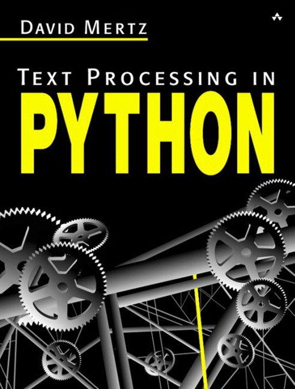

# Text Processing in Python by David Mertz

http://gnosis.cx/TPiP/

| Table of Contents | 
| ------------- |
| [Acknowledgments](./gnosis.cx/TPiP/acknowledgments.txt) | 
| [Introduction](./gnosis.cx/TPiP/intro.txt) | 
| [Chapter 1: Python Basics](./gnosis.cx/TPiP/chap1.txt) | 
| [Chapter 2: Basic String Operations](./gnosis.cx/TPiP/chap2.txt) | 
| [Chapter 3: Regular Expressions](./gnosis.cx/TPiP/chap3.txt) | 
| [Chapter 4: Parsers and State Machines](./gnosis.cx/TPiP/chap4.txt) | 
| [Chapter 5: Internet Tools and Techniques](./gnosis.cx/TPiP/chap5.txt) | 
| [Appendix A: A Selective and Impressionistic Short Review of Python](./gnosis.cx/TPiP/appendix_a.txt) | 
| [Appendix B: A Data Compression Primer](./gnosis.cx/TPiP/appendix_b.txt) | 
| [Appendix C: Understanding Unicode](./gnosis.cx/TPiP/appendix_c.txt) | 
| [Appendix D: A State-Machine for Adding Markup to Text ](./gnosis.cx/TPiP/appendix_d.txt) | 
| [Glossary](./gnosis.cx/TPiP/glossary.txt) | 
| [Errata](./gnosis.cx/TPiP/errata.txt) | 
